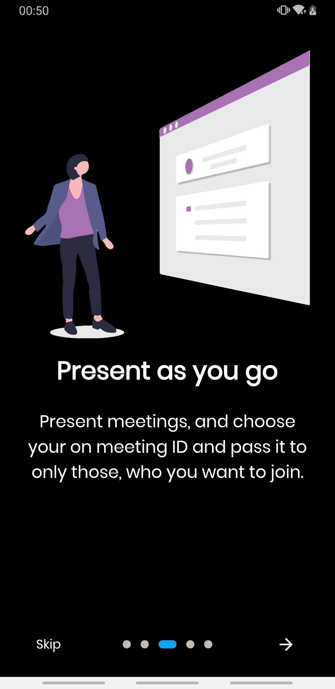
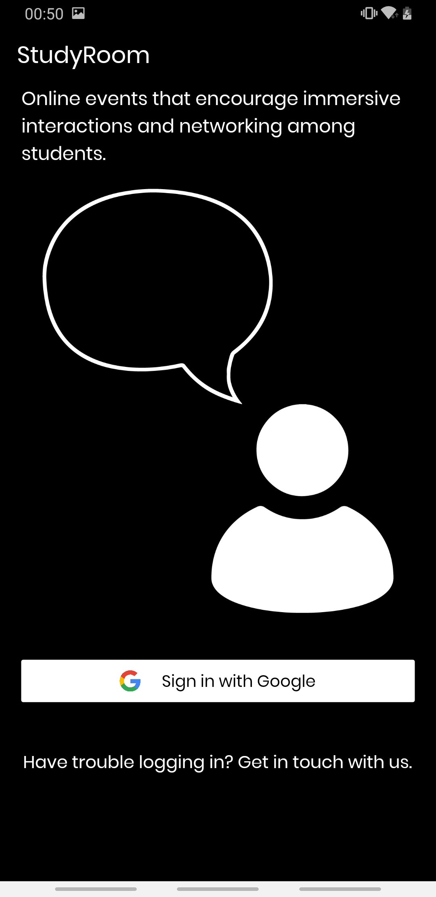
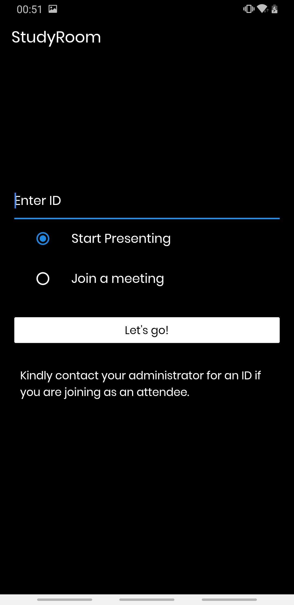

# StudyRoom

A virtual classroom app, built using Agora SDK for live video call, enabling better usability and an immersive classroom experience for the teachers and the students.
<br>

[](https://codemagic.io/apps/5f3d9d7697f3953237203126/5f3d9d7697f3953237203125/latest_build)

## Inspiration 
In these Covid-19 times, most of the classes happen online, and even though there are apps like Zoom, Google Meet, etc. students as well as the teachers dont get the feel of a classroom, which can hamper the learning experience in some way, as students might not feel motivated enough to attend an online class. The StudyRoom app provides an infrastructure for students to experience a totally virtually classroom, where they can take a seat on the virtual benches with their classmates and attend lectures, just like a real classroom.

## What it does
The StudyRoom app allows the teacher to create a virtual room for her class, and share the classroom ID to her students. Students can signup to the app via Google and enter the virtual class. The virtual class will have numerous benches wherein a student can take a seat with his fellow classmates. The teacher can deliver a live video lecture and also choose to present her screen to the class.

## Features
###### 1 . Home Page
 

###### 2 . Signup /Login
 
 
###### 3 . Enter a Study Room
 


## Getting Started

This project is a starting point for a Flutter application.

A few resources to get you started if this is your first Flutter project:

- [Lab: Write your first Flutter app](https://flutter.dev/docs/get-started/codelab)
- [Cookbook: Useful Flutter samples](https://flutter.dev/docs/cookbook)

For help getting started with Flutter, view our
[online documentation](https://flutter.dev/docs), which offers tutorials,
samples, guidance on mobile development, and a full API reference.

## Run

```
flutter doctor
```
Make sure you have the requirements shown at the output, including XCode, Cocapods for iOS and macOS devices.

Navigate to project directory and run 
```
flutter clean
```
Open the project in Android Studio or VSCode and make sure you have Flutter pre-requisites needed for running the app, including the Dart and Flutter extension and manually run the files. For iOS devices, open the project in XCode and navigate to iOS files and open up Runner.xcproj and set up team and signing on XCode and run the program. 

Issues may occur while trying to run the app on XCode for iOS, hence follow the commands:

```
flutter clean
```
```
pod install
```
If no pods are found, continue to run the app on XCode.

## What's next for StudyRoom
We would like to incorporate features like setting deadlines for an assignments, a scheduler for planning lecture timings, a tracker for recording scores assigned to each student and whiteboarding facility to a teacher.
